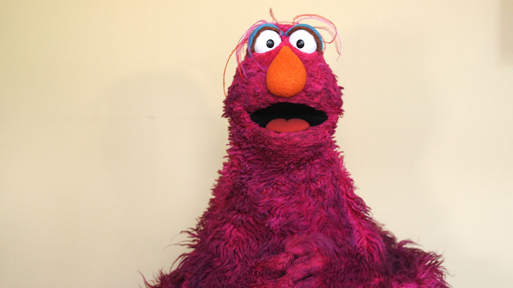

# Towards Efficient Fine-tuning of Pre-trained Code Models: An Experimental Study and Beyond



 In this paper, we conduct an extensive experimental study to explore what happens to layer-wise pre-trained representations and their encoded code knowledge during fine-tuning. We then propose efficient alternatives to fine-tune the large pre-trained code model based on the above findings. Our experimental study shows that：
 
 * lexical, syntactic and structural properties of source code are encoded in the lower, intermediate, and higher layers, respectively, while the semantic property spans across the entire model. 
 
 * The process of fine-tuning preserves most of the code properties. Specifically, the basic code properties captured by lower and intermediate layers are still preserved during fine-tuning. Furthermore, we find that only the representations of the top two layers change most during fine-tuning for various downstream tasks. 

* Based on the above findings, we propose **Telly** to efficiently fine-tune pre-trained code models via layer freezing. The extensive experimental results on five various downstream tasks demonstrate that training parameters and the corresponding time cost are greatly reduced, while performances are similar or better.
## The Overview of Datasets

### Probing Tasks


|Task|Dataset|Language|Train\val\test Size|Download Link|
|:--:|:--|:--|:--|:--|
Lexical, Syntax and Structural probing|CodeSearchNet | Python |251K/9.6K/1K |[python.zip](https://s3.amazonaws.com/code-search-net/CodeSearchNet/v2/python.zip)|
Semantic probing|POJ-104 | C/C++ |32K/8K/8K |[programs.tar.gz](https://drive.google.com/uc?id=0B2i-vWnOu7MxVlJwQXN6eVNONUU)|


### Downstream Tasks

|Task|Dataset|Language|Train\val\test Size|Download Link|
|:--:|:--|:--|:--|:--|
Code search|CodeSearchNet | Python |251K/9.6K/1K |[python.zip](https://s3.amazonaws.com/code-search-net/CodeSearchNet/v2/python.zip)|
Code search|CodeSearchNet | Ruby |24.9K/1.4K/1.3K |[ruby.zip](https://s3.amazonaws.com/code-search-net/CodeSearchNet/v2/ruby.zip)|
Clone detection|BigCloneBench | Java |901K/416K/416K|[data.jsonl](https://github.com/microsoft/CodeXGLUE/raw/main/Code-Code/Clone-detection-BigCloneBench/dataset/data.jsonl), [train.txt](https://github.com/microsoft/CodeXGLUE/raw/main/Code-Code/Clone-detection-BigCloneBench/dataset/train.txt), [valid.txt](https://github.com/microsoft/CodeXGLUE/raw/main/Code-Code/Clone-detection-BigCloneBench/dataset/valid.txt), and [test.txt](https://github.com/microsoft/CodeXGLUE/raw/main/Code-Code/Clone-detection-BigCloneBench/dataset/test.txt)|
Code summarizaton|CodeSearchNet | Python |251K/9.6K/1K |[python.zip](https://s3.amazonaws.com/code-search-net/CodeSearchNet/v2/python.zip)|
Code summarizaton|CodeSearchNet | Ruby |24.9K/1.4K/1.3K |[ruby.zip](https://s3.amazonaws.com/code-search-net/CodeSearchNet/v2/ruby.zip)|
Code generation|CONCODE |Java |100K/2K/2K|[train.json](https://github.com/microsoft/CodeXGLUE/raw/main/Text-Code/text-to-code/dataset/concode/train.json),[valid.json](https://github.com/microsoft/CodeXGLUE/raw/main/Text-Code/text-to-code/dataset/concode/dev.json), and [test.json](https://github.com/microsoft/CodeXGLUE/raw/main/Text-Code/text-to-code/dataset/concode/test.json)|
Code completion|Github Java Corpus | Java |12K/1.5K/1.5K|[data.tar.bz2](DownstreamTasks/code-completion/dataset/data.tar.bz2)|


## Environment
```
conda create -n CoCoSoDa python=3.6 -y
conda activate CoCoSoDa
pip install torch==1.10  transformers==4.12.5 seaborn==0.11.2 fast-histogram nltk==3.6.5 fuzzywuzzy==0.18.0
pip install tree_sitter tqdm prettytable gdown more-itertools tensorboardX sklearn 
```

## Research Questions

### RQ1: What code properties are encoded in layer-wise pre-trained representations?


We use the four probing tasks related to lexical, syntactic, semantic and structural properties to explore what code properties are encoded in layer-wise pre-trained representations and how much representations of each layer contribute to understanding these code properties. At the same time, we also compare pre-trained and fine-tuned layer-wise representations in the same setting.


All the experiment results can be found [here](RQs/RQ1.ipynb).

### RQ2: What happens to the layer-wise representations during fine-tuning?

We also conduct extensive experiments on representational similarity analysis (RSA) to study what happens to the layer-wise representations of the pre-trained model during the fine-tuning for five diverse downstream tasks without the help of probing tasks. The downstream tasks include code search, clone detection, code summarization, code generation, and line-level code completion.  

All the experiment results can be found [here](RQs/RQ2.ipynb).
### RQ3: Are there efficient alternatives to fine-tuning?

Based on the results of the experimental study, we investigate more efficient alternatives to fine-tune pre-trained code models. Our primary motivation is to freeze the pre-trained parameters of those layers that change only slightly during the fine-tuning of downstream tasks. We propose **Telly-K**. **K** means freezing the pre-trained parameters of the bottom **K** layers and different **K** means different variants of our approach.   We vary **K** from 0 to 11 and conduct extensive experiments on five downstream tasks for these 12 model variants.

All the experiment results can be found [here](RQs/RQ3.ipynb).